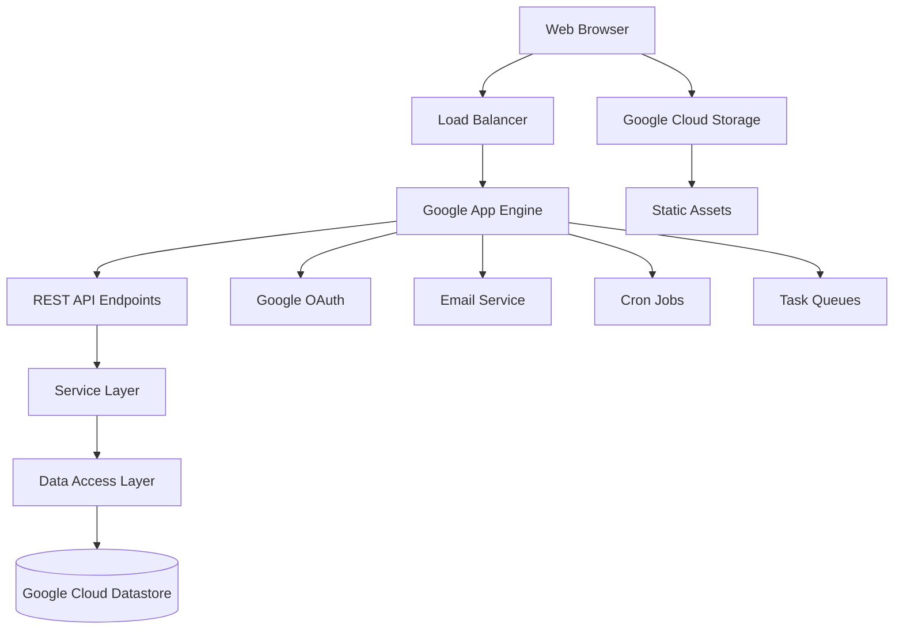

# Tech Gallery

[](LICENSE)

> A living technology catalog for CI&T employees to discover, evaluate, and share knowledge
> about technologies through social features and peer recognition.

## Table of Contents

- [Overview](#overview)
- [Quickstart](#quickstart)
- [Configuration](#configuration)
- [Usage](#usage)
- [Architecture](#architecture)
- [Development](#development)
- [Deployment](#deployment)
- [Troubleshooting](#troubleshooting)
- [Contributing](#contributing)
- [License](#license)

## Overview

**Tech Gallery** is an internal CI&T application that serves as a comprehensive technology
catalog platform. The application enables employees to:

- **Discover Technologies**: Browse, search, and filter technologies with detailed information
- **Social Knowledge Sharing**: Comment, recommend (thumbs up/down), and discuss technologies
- **Peer Recognition**: Endorse colleagues for their expertise in specific technologies
- **Skill Tracking**: Self-assess and track proficiency levels across technologies
- **Activity Notifications**: Receive daily email summaries of followed technologies and endorsements

**Target Users**: CI&T employees (restricted to @ciandt.com domain)

**Key Features**:

- Google OAuth authentication with domain restriction
- Technology CRUD operations with social counters
- Real-time search and filtering capabilities
- Email notification system with daily summaries
- Admin controls for technology management
- User profile and skill management

## Quickstart

### Prerequisites

- OS: Linux/macOS/Windows
- Java: JDK 1.7 or higher
- Maven: 3.1.0 or higher
- Google App Engine SDK
- Node.js: v0.10.25 (for frontend dependencies)
- npm: 1.3.10

### Setup

```bash
git clone https://github.com/COG-GTM/ci-t_open_issues.git
cd ci-t_open_issues
mvn clean install
```

### Run Development Server

```bash
mvn appengine:devserver
```

### Verify Installation

```bash
# Application should be running at:
curl -i http://localhost:8080/

# API Explorer available at:
# http://localhost:8080/_ah/api/explorer

# Main application interface:
# http://localhost:8080/techList.html
```

## Configuration

### Required Configuration

| Name | Location | Description |
| --- | --- | --- |
| `application` | `src/main/webapp/WEB-INF/appengine-web.xml` | Google App Engine application ID |
| `WEB_CLIENT_ID` | `src/main/java/com/ciandt/techgallery/Constants.java` | Google OAuth web client ID |
| `app.version` | Maven property | Application version for deployment |

### Optional Configuration

| Name | Default | Description |
| --- | --- | --- |
| `ANDROID_CLIENT_ID` | "replace this with your Android client ID" | Android OAuth client ID |
| `IOS_CLIENT_ID` | "replace this with your iOS client ID" | iOS OAuth client ID |
| `app.id` | tech-gallery | App Engine application identifier |

### Email Configuration

The application uses Google App Engine's email service with the following settings:

- **Sender**: `google-project@ciandt.com`
- **Daily Activity Summary**: Every day at 22:00
- **Daily Endorsement Summary**: Every day at 20:00
- **Queue**: `email-queue` with 1 message/second rate limit

### Authentication Scopes

- `https://www.googleapis.com/auth/userinfo.email`
- `https://www.googleapis.com/auth/plus.me`
- `https://www.googleapis.com/auth/plus.stream.write`

## Usage

### Web Interface

#### Technology Browsing

```bash
# Access main technology list
# http://localhost:8080/techList.html

# View specific technology
# http://localhost:8080/viewTech?id=<technology-id>

# Create/edit technology (authenticated users)
# http://localhost:8080/createTech.html
```

#### Search and Filtering

- Text search across technology names and descriptions
- Filter by recommendation status (Recommended/Not Recommended/etc.)
- Sort by various criteria (name, date, popularity)
- Date-based filtering (last day, 7 days, 30 days)

### REST API Examples

#### Get Technologies

```bash
curl -H "Authorization: Bearer <token>" \
  "http://localhost:8080/_ah/api/rest/v1/technology"
```

#### Search Technologies

```bash
curl -H "Authorization: Bearer <token>" \
  "http://localhost:8080/_ah/api/rest/v1/technology/search?titleContains=java"
```

#### Add Technology

```bash
curl -X POST -H "Authorization: Bearer <token>" \
  -H "Content-Type: application/json" \
  -d '{"name":"React","shortDescription":"JavaScript library"}' \
  "http://localhost:8080/_ah/api/rest/v1/technology"
```

### User Authentication

```javascript
// Frontend authentication flow
gapi.load('auth2', function() {
  gapi.auth2.init({
    client_id: 'YOUR_WEB_CLIENT_ID'
  });
});
```

## Architecture



### Key Components

#### Frontend Layer

- **AngularJS Application**: Single-page application with three main controllers
  - `techListController.js` - Technology browsing and search interface
  - `techDetailsController.js` - Individual technology view with social features  
  - `createTechController.js` - Technology creation and editing forms
- **Bootstrap UI**: Responsive design with custom CSS
- **Google API Client**: Authentication and backend communication

#### Backend Service Layer

- **TechnologyServiceImpl**: Core CRUD operations, filtering, and counter management
- **UserServiceTGImpl**: User authentication, synchronization with external APIs
- **EndorsementServiceImpl**: Peer endorsement system with grouping logic
- **SkillServiceImpl**: User skill rating and proficiency tracking
- **EmailServiceImpl**: Asynchronous email notifications via task queue
- **CronServiceImpl**: Daily summary email generation

#### API Layer

- **Google Cloud Endpoints**: RESTful APIs with OAuth integration
- **Domain Restriction**: Limited to @ciandt.com email addresses
- **10 Endpoint Classes**: Technology, User, Endorsement, Skill, Recommendation, etc.

#### Data Layer

- **Objectify ORM**: Entity mapping and datastore operations
- **Google Cloud Datastore**: NoSQL document database
- **Composite Indexes**: Optimized queries via `datastore-indexes.xml`

### Core Entities

- **Technology**: Main entity with social interaction counters
- **TechGalleryUser**: Internal user representation linked to Google accounts
- **Endorsement**: Links endorser, endorsed user, and technology
- **Skill**: User proficiency rating (1-5) for technologies
- **TechnologyComment**: User comments with timestamp and active status
- **TechnologyRecommendation**: Thumbs up/down with optional comments

## Development

### Local Development Setup

```bash
# Install dependencies
mvn clean install

# Install frontend dependencies (automatic via Maven)
cd src/main/webapp
npm install
bower install

# Run development server with hot reload
mvn appengine:devserver

# Run with debugging enabled
mvn appengine:devserver -Ddebug=true
```

### Code Quality

```bash
# Run checkstyle (Google style)
mvn checkstyle:check

# Run tests
mvn test

# Run with QA profile (includes checkstyle, cobertura, dependency check)
mvn clean install -P QA

# Generate coverage report
mvn cobertura:cobertura
```

### Frontend Development

```bash
# Navigate to webapp directory
cd src/main/webapp

# Install Gulp for build tasks
npm install -g gulp

# Run CSS linting
gulp csslint

# Run JavaScript linting
gulp jshint
```

### Database Development

```bash
# Generate client libraries
mvn appengine:endpoints_get_client_lib

# View datastore in development
# http://localhost:8080/_ah/admin/datastore
```

## Deployment

### Google App Engine Deployment

```bash
# Deploy to App Engine
mvn appengine:update

# Deploy with specific version
mvn appengine:update -Dapp_version=v1-0-1

# Deploy using gcloud (alternative)
mvn gcloud:deploy
```

### Docker Deployment (Alternative)

```bash
# Build WAR file
mvn clean package

# Deploy WAR to servlet container
# Copy target/techgallery-1.0-SNAPSHOT.war to your servlet container
```

### Configuration for Production

1. **Update Application ID**

   ```xml
   <!-- src/main/webapp/WEB-INF/appengine-web.xml -->
   <application>your-production-app-id</application>
   ```

2. **Update OAuth Client IDs**

   ```java
   // src/main/java/com/ciandt/techgallery/Constants.java
   public static final String WEB_CLIENT_ID = "your-production-client-id";
   ```

3. **Set Production Version**

   ```bash
   mvn appengine:update -Dapp_version=production
   ```

### Health Checks

- **Application Health**: `http://your-app.appspot.com/`
- **API Health**: `http://your-app.appspot.com/_ah/api/explorer`
- **Admin Console**: `http://your-app.appspot.com/_ah/admin`

## Troubleshooting

### Common Issues

#### Build Failures

```bash
# Clear Maven cache
mvn dependency:purge-local-repository

# Reinstall dependencies
mvn clean install -U
```

#### Authentication Issues

- Verify OAuth client IDs in `Constants.java`
- Check domain restriction settings in Google Cloud Console
- Ensure user email domain is @ciandt.com

#### Frontend Issues

```bash
# Clear npm cache
npm cache clean --force

# Reinstall frontend dependencies
cd src/main/webapp
rm -rf node_modules bower_components
npm install
bower install
```

#### Database Issues

- Check datastore indexes in App Engine console
- Verify entity relationships in Objectify configuration
- Review composite index definitions in `datastore-indexes.xml`

#### Email Issues

- Verify App Engine email quotas
- Check cron job configuration in `cron.xml`
- Review task queue settings in `queue.xml`

### Development Server Issues

#### Port Already in Use

```bash
# Kill existing processes
lsof -ti:8080 | xargs kill -9

# Use different port
mvn appengine:devserver -Dappengine.port=8081
```

#### Memory Issues

```bash
# Increase JVM memory
export MAVEN_OPTS="-Xmx1024m -XX:MaxPermSize=256m"
mvn appengine:devserver
```

## Contributing

See [CONTRIBUTING.md](CONTRIBUTING.md) for detailed contribution guidelines.

### Quick Start for Contributors

1. Fork the repository
2. Create a feature branch: `git checkout -b feature/your-feature`
3. Follow the development setup instructions
4. Run tests and quality checks before committing
5. Submit a pull request with clear description

### Code Standards

- Follow Google Java Style Guide
- Use meaningful variable and method names
- Add JSDoc comments for JavaScript functions
- Maintain test coverage above 80%
- Run `mvn checkstyle:check` before committing

## License

This project is licensed under the MIT License - see the [LICENSE](LICENSE) file for details.

**SPDX-License-Identifier**: MIT

---

**Maintainer**: CI&T Development Team  
**Contact**: <google-project@ciandt.com>  
**Support Policy**: Best-effort support during business hours (PT)
